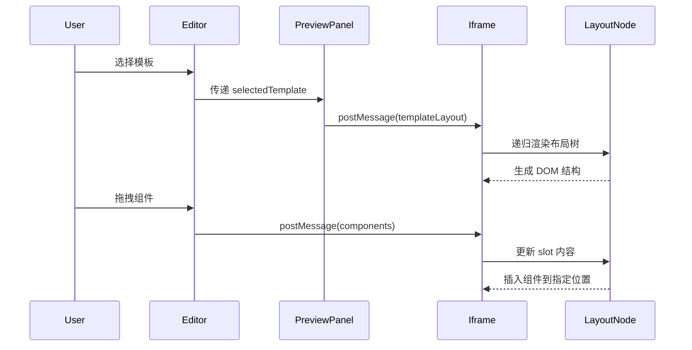

# 预览系统架构说明

## 📐 架构设计

### 核心思想

**预览系统根据模板配置动态渲染布局，不再硬编码固定结构。**

```
┌─────────────────┐      ┌──────────────────┐      ┌─────────────────┐
│  选择模板       │ ───> │  加载 template   │ ───> │  动态渲染布局   │
│  (Editor)       │      │  .previewLayout  │      │  (iframe)       │
└─────────────────┘      └──────────────────┘      └─────────────────┘
                                   │
                                   ↓
                         ┌──────────────────┐
                         │  递归渲染组件树  │
                         │  - h-page-*      │
                         │  - drop zones    │
                         │  - slot 插入点   │
                         └──────────────────┘
```

---

## 🔧 技术实现

### 1. **模板配置 (template.json)**

每个模板都定义 `previewLayout`，描述预览时的布局结构：

```json
{
  "previewLayout": {
    "description": "预览时的动态布局配置",
    "root": {
      "component": "h-page-container",
      "class": "h-page-container",
      "children": [
        {
          "component": "h-page-header",
          "props": {
            "title": "{{pageInfo.title}}",
            "breadcrumb": "{{pageInfo.breadcrumb}}"
          }
        },
        {
          "component": "div",
          "class": "drop-zone h-page-search",
          "dropZone": "search",
          "slots": {
            "default": "searchArea"
          },
          "emptyText": "拖拽搜索组件到这里"
        }
      ]
    }
  }
}
```

**关键字段说明：**

| 字段 | 类型 | 说明 |
|------|------|------|
| `component` | String | 要渲染的组件名 (如 `div`, `h-page-container`) |
| `class` | String | CSS 类名 |
| `props` | Object | 组件的 props，支持 `{{变量}}` 插值 |
| `dropZone` | String | 拖拽区域标识（如 `search`, `table`） |
| `slots` | Object | slot 映射，key 为 slot 名，value 为 `components` 中的区域名 |
| `emptyText` | String | 空状态提示文本 |
| `children` | Array | 子节点数组（递归） |

---

### 2. **预览 iframe (preview-iframe.html)**

#### 核心组件：`layout-node`

递归组件，负责渲染布局树：

```vue
<layout-node
  :node="templateLayout.root"
  :config="config"
  :drag-over-zone="dragOverZone"
  :selected-component-id="selectedComponentId"
  @dragover="handleDragOver"
  @drop="handleDrop"
  @select-component="handleSelectComponent"
/>
```

**功能：**
- ✅ **递归渲染**：支持任意深度的嵌套结构
- ✅ **动态组件**：根据配置动态创建组件
- ✅ **模板变量**：支持 `{{pageInfo.title}}` 等插值
- ✅ **Slot 映射**：将用户拖拽的组件插入到指定位置
- ✅ **Drop Zone**：自动识别拖拽区域并处理事件

---

### 3. **PreviewPanel.vue**

负责向 iframe 发送配置：

```javascript
const config = {
  pageInfo: editorStore.pageConfig.pageInfo,
  components: editorStore.pageConfig.components,
  templateLayout: editorStore.selectedTemplate?.previewLayout || null, // 👈 模板布局
  template: { ... }
}

previewIframe.value.contentWindow.postMessage({
  type: 'update-preview',
  config
}, '*')
```

---

## 🎯 工作流程

### 用户操作流程



### 切换模板流程

```
1. 用户选择新模板
   ↓
2. Editor 更新 selectedTemplate
   ↓
3. PreviewPanel 读取 template.previewLayout
   ↓
4. 通过 postMessage 发送到 iframe
   ↓
5. iframe 接收后更新 templateLayout
   ↓
6. layout-node 重新递归渲染
   ↓
7. ✨ 布局完全切换！
```

---

## 🚀 优势

### ✅ 真正的模板系统
- 不同模板有不同的布局结构
- 切换模板实时生效
- 模板配置可扩展

### ✅ 灵活性
- 支持任意嵌套层级
- 支持自定义组件
- 支持动态插值

### ✅ 可维护性
- 布局配置与渲染逻辑分离
- 递归组件代码简洁
- 易于添加新模板

---

## 📝 添加新模板

### Step 1: 创建模板目录

```bash
templates/my-new-template/
  ├── template.json       # 模板配置
  ├── page.vue.hbs       # 代码生成模板
  └── README.md          # 说明文档
```

### Step 2: 定义 previewLayout

在 `template.json` 中添加：

```json
{
  "id": "my-new-template",
  "label": "我的新模板",
  "previewLayout": {
    "root": {
      "component": "div",
      "class": "my-custom-layout",
      "children": [
        {
          "component": "div",
          "class": "drop-zone custom-zone",
          "dropZone": "customArea",
          "slots": {
            "default": "customComponents"
          },
          "emptyText": "拖拽组件到这里"
        }
      ]
    }
  }
}
```

### Step 3: 在 editorStore 中注册

模板会自动从 `templates/` 目录加载。

---

## 🔍 调试技巧

### 查看模板配置

打开浏览器控制台：

```javascript
// 查看当前模板布局
console.log('Template Layout:', app.templateLayout)

// 查看组件配置
console.log('Components:', app.config.components)
```

### 检查渲染树

在 `layout-node` 组件中添加：

```javascript
created() {
  console.log('Rendering node:', this.node)
}
```

---

## 🎨 示例：标准列表页

```
h-page-container
├── h-page-header (显示标题和面包屑)
└── h-page-content
    ├── div.drop-zone (搜索区)
    │   └── slot: searchArea
    │       ├── el-input (用户拖拽)
    │       ├── el-select (用户拖拽)
    │       └── el-button (查询/重置)
    └── div.drop-zone (表格区)
        ├── slot: actionArea (按钮)
        ├── el-table (固定)
        └── el-pagination (固定)
```

---

## ⚠️ 注意事项

1. **模板变量格式**：使用 `{{pageInfo.title}}`，不是 `${}`
2. **Slot 命名**：必须与 `components` 中的 key 一致
3. **Drop Zone**：`dropZone` 字段必须唯一
4. **递归深度**：建议不超过 10 层

---

## 📚 相关文件

| 文件 | 说明 |
|------|------|
| `templates/standard-list/template.json` | 标准列表页模板配置 |
| `public/preview-iframe.html` | 预览 iframe 实现 |
| `src/components/PreviewPanel.vue` | 预览面板组件 |
| `src/stores/editorStore.js` | 编辑器状态管理 |

---

## 📖 总结

通过 `previewLayout` 配置和 `layout-node` 递归组件，我们实现了：

✅ **真正的模板系统** - 不同模板有不同的布局  
✅ **动态渲染** - 根据配置生成 DOM  
✅ **可扩展性** - 易于添加新模板  
✅ **用户友好** - 切换模板实时生效  

**不再是硬编码的固定布局！** 🎉

